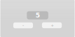

# Counter

This tutorial will introduce the two most important concepts of the `actions` library:

A **component** describes (a part) of the state of an application.<br>
**Actions** describe how the state of an application should change.

#### Some setup
First make sure you are using the `actions` crate. Make sure to have `actions` as a dependency in your `Cargo.toml` file. If you are unfamiliar with Cargo, check out the [Cargo book](https://doc.rust-lang.org/cargo/index.html)).

```toml
[dependencies]
actions = "0.0.2"
```

Then make sure to specify `actions` as a dependency in your project, and import the `Component` trait. We will also need action's `Error`. 

```rust
{{#include ../../examples/simple.rs:1:4}}
```

## Building the counter
One of the easiest examples for explaining `actions` is a counter. The counter has two buttons: an decrement button, and an increment button.

</img>

Our task is to write the logic for the counter. Easy!

### Step one: Defining the component
One of the most important aspect of the counter is storing the value displayed in the counter. We will use an integer to store the value.

As the counter holds just one value, it can be described like this:

```rust
{{#include ../../examples/simple.rs:6}}
```

### Step two: The actions
Maybe even more important than the counter are the two buttons.

The decrement button should decrement the counter by 1, and the increment button should increment the counter by 1.

Incrementing and decrementing are **actions**. It is immediately clear how executing those actions influences the **component** and therefore the state of the application.

Let's convert these actions into Rust-code.

```rust
{{#include ../../examples/simple.rs:8:12}}
```

That's it! You've defined your actions.

### Step three: Defining the behaviour of the component
Step three is defining how the state of the component should change when an action is executed.

#### Implementing the `Component` trait
`Counter` is a `Component`, as it describes the state of our application. Therefore, we will implement the `Component` trait for it.

```rust
{{#include ../../examples/simple.rs:14:32}}
```

Note that the apply-function is returning the inverse of the action that was performed. This can be used to 'undo' the action (will be discussed in another tutorial).

If the action has no effect on the state of the component, the apply function should return `None`.

### Testing the counter
That was all you need for the logic of the counter. Now, let's test it.

```rust
{{#include ../../examples/simple.rs:34:47}}
```

It works! You can find the final code from this tutorial <a href="https://github.com/actions-library/actions/blob/master/examples/simple.rs" target="_blank">here</a>.